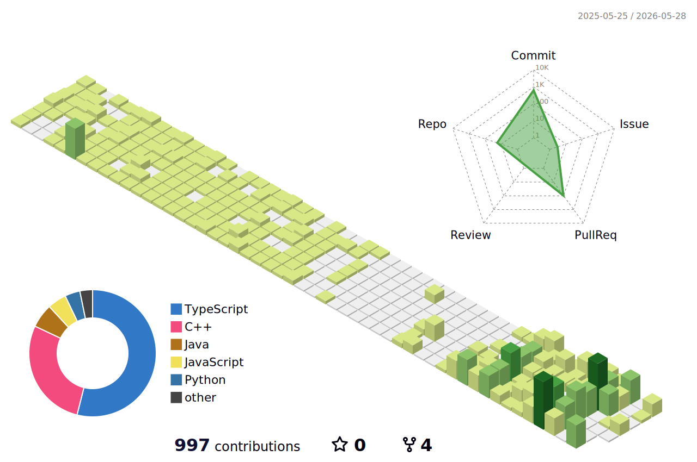

# 🚀 Ayush Chaurasiya

<p align="center">

</p>

<p align="center">
🚀 Frontend Developer | MERN Stack Enthusiast | Competitive Programmer
</p>

---

# 🧑‍💻 Developer Profile

```javascript
const ayush = {
  name: "Ayush Chaurasiya",
  role: "Frontend Developer & Competitive Programmer",

  languages: ["JavaScript", "Java", "C++"],

  technologies: {
    frontend: ["React", "Next.js", "TailwindCSS", "Bootstrap"],
    backend: ["Node.js", "Express"],
    database: ["MongoDB"],
    tools: ["Git", "GitHub", "Vercel", "Figma"]
  },

  currentlyLearning: [
    "Advanced React Patterns",
    "Next.js App Router",
    "Backend Architecture",
    "Cloud Deployment"
  ],

  interests: [
    "Competitive Programming",
    "API Development",
    "Building Scalable Web Applications"
  ],

  funFact:
    "Java was my first love 💛 but debugging JavaScript gives a different thrill 🐞"
};
```

---

# 🏆 Competitive Programming

<p align="center">


</p>

<p align="center">


</p>


<p align="center">


</p>

<p align="center">

<a href="https://www.hackerrank.com/ayushchaurasiya">

</a>

</p>

---

# 📊 GitHub Analytics

<p align="center">


</p>

<p align="center">


</p>

---

# 🧠 Tech Stack

### Languages


### Frontend


### Backend


### Database


### Tools


---

# 📈 Contribution Graph

<p align="center">


</p>

---

# 🌐 Connect With Me

<p align="center">

<a href="https://instagram.com/_ayush_chaurasiya">

</a>

<a href="https://linkedin.com/in/ayush_chaurasiya">

</a>

<a href="mailto:ayushchaurasiya9532951470@gmail.com">

</a>

</p>

---

# ✍️ Dev Quote

<p align="center">


</p>

---

<p align="center">
💡 “Code. Debug. Learn. Repeat.”
</p>


<p align="center">

</p>


## 🧊 3D Contribution Cube
